# 📱 Mini App de Autenticación con Flutter & Firebase

La aplicación móvil tiene las siguientes funcionalidades:
-	Permite registrarse como usuario, para lo cual, será necesario ingresar credenciales (usuario y contraseña) y datos personales (Nombre, edad y correo electrónico).
-	Permite autenticarse a través del uso de un usuario y una contraseña válidos.

## 🚀 Características Principales

- **Autenticación** con Firebase Auth
- **Formulario de registro** con validaciones (Firebase: Realtime Database)
  - Nombre completo (solo caracteres válidos)
  - Edad (número positivo)
  - Email (formato válido)
  - Contraseña (mínimo 6 caracteres)
- **Pantalla de inicio personalizada** con mensaje de Bienvenida
- **Logout**
- **Persistencia de sesión**
- **Manejo de errores** completo

## 🛠 Stack Tecnológico

| Tecnología       | Uso                          |
|------------------|------------------------------|
| Flutter          | Framework principal (v3.19+) |
| Firebase Auth    | Autenticación de usuarios    |
| Realtime Database| Almacenamiento de datos      |
| Provider         | Gestión de estado            |

## 📸 Capturas de Pantalla

| Login | Registro | Home |
|-------|----------|------|
| 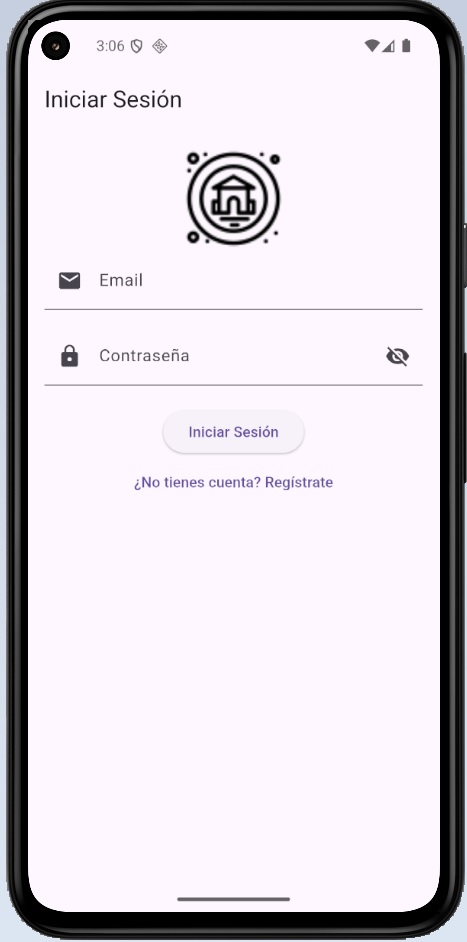 | 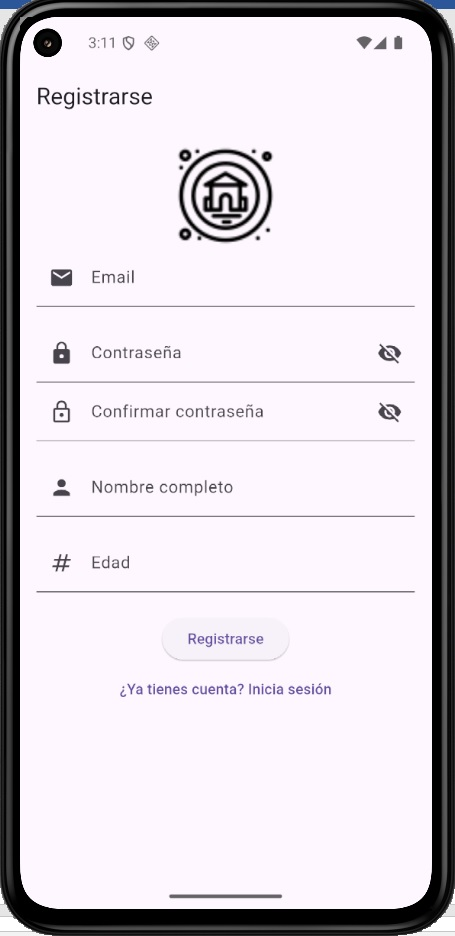 | 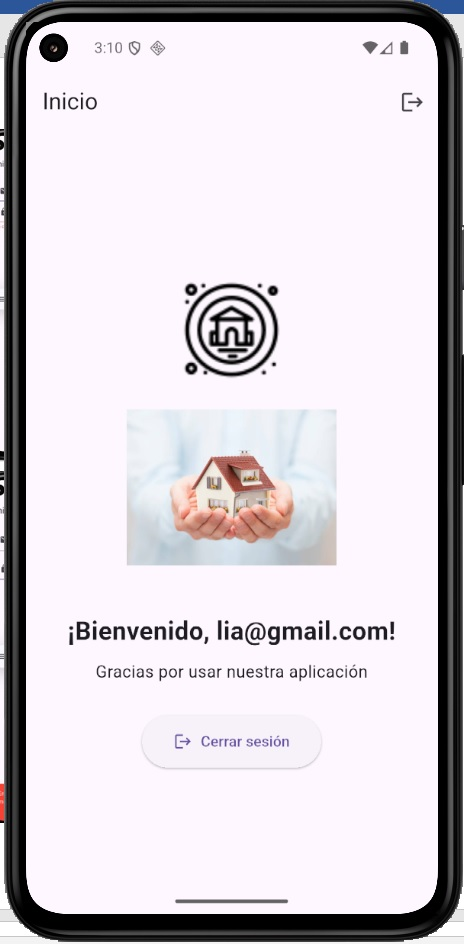 |

## Otras capturas de pantalla de la app

| 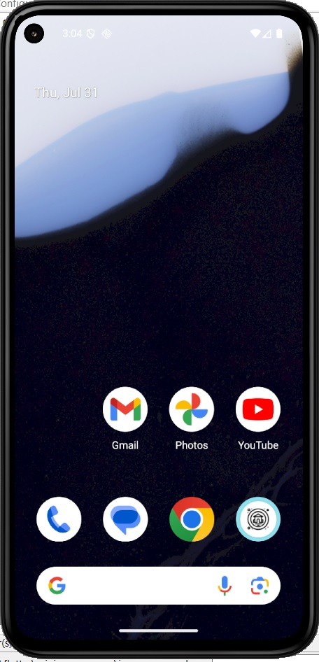 | 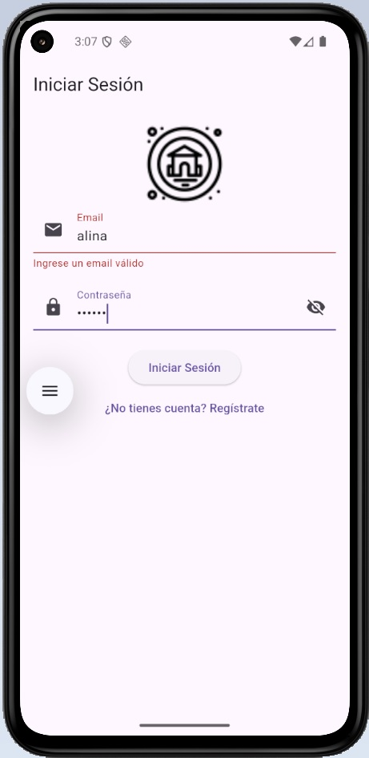 | 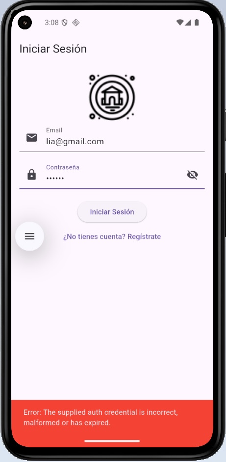 |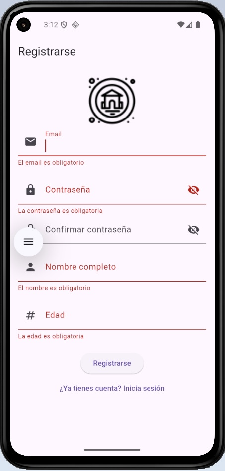 ||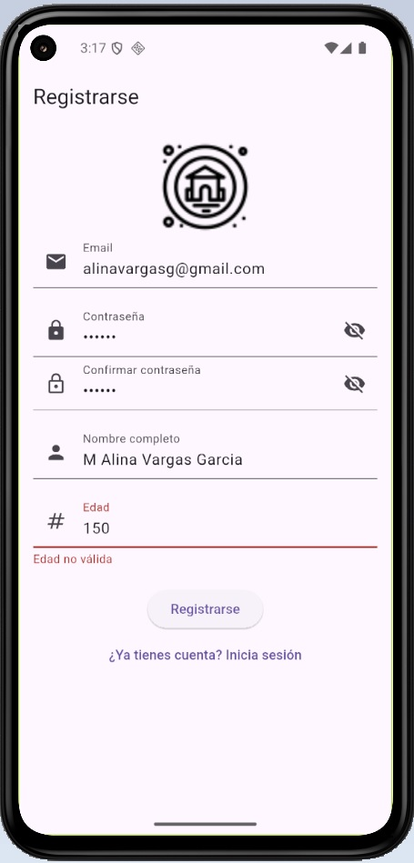|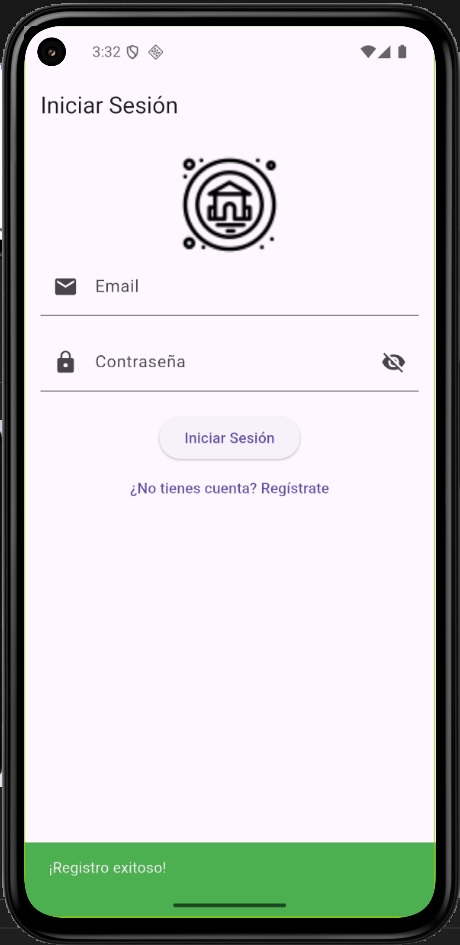|

## Capturas de pantalla correspondientes a Firebase

| Usuarios registrados | Configuracion validacion email | Datos tiempo real |
|-------|----------|------|
| 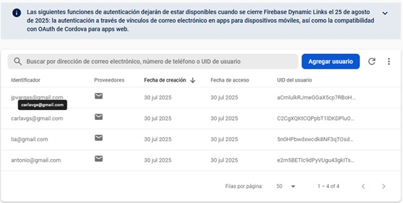 | 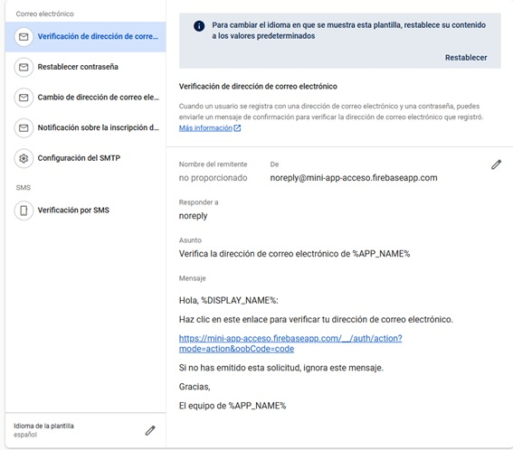 | 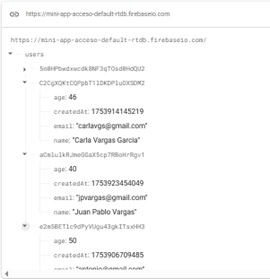 |

## 🔧 Configuración

1. **Clona el repositorio**
   ```bash
   git clone https://github.com/alinavargasg/mini-app-acceso
   cd mini-app-acceso